# Awesome-Cloud-Software-Marketplace

# Awesome-Cloud-Software-Marketplace 🏪 ☁️

  

  

  

  

  

  

  

---

## 🌟 Top Cloud Software Marketplace Ecosystem

**Curated List of Commercial Software Marketplaces & Open-Source Marketplace Platforms**  

*Focused on Cloud Marketplace Listing, Private Marketplace Governance, SaaS Subscription Management, Revenue Sharing & Self-Hosted App Stores*

**Last updated: October 2026** 📅

---

### 📌 Overview & SEO Summary

Welcome to the ultimate curated directory of **cloud software marketplaces**, **open-source marketplace platforms**, and **app store frameworks**. Whether you are looking for enterprise-grade commercial solutions (such as *AWS Marketplace*, *Microsoft Commercial Marketplace*, and *Snowflake Marketplace*), or self-hostable open-source alternatives (like *Sharetribe*, *Medusa*, and *OpenChannel*), this list covers category leaders, private marketplace governance, and privacy-respecting software distribution.

**Key Market Context:**

- **AWS Marketplace** offers **pay-as-you-go pricing** with **consolidated billing** through AWS invoices, and **Private Marketplaces** for organizational procurement controls.

- **Microsoft Commercial Marketplace** provides **Azure benefit eligibility** for MACC consumption commitments and **transactable SaaS offers** with **15% reduction** on standard marketplace fees for IP Co-sell eligible partners.

- **Snowflake Marketplace** enables **data and application sharing** without data movement, with **usage-based pricing** directly integrated into Snowflake billing.

---

## 📑 Table of Contents

- [🏢 SaaS & Commercial Platforms](#-saas--commercial-platforms)

- [🔓 Open-Source GitHub Projects](#-open-source-github-projects)

- [🛠️ How to Contribute](#%EF%B8%8F-how-to-contribute)

- [📊 Star History](#-star-history)

- [🤝 Support & Sponsorship](#-support--sponsorship)

- [⚠️ Disclaimer](#%EF%B8%8F-disclaimer)

---

## 🏢 SaaS / Commercial Platforms

The cloud software marketplace market spans **hyperscaler marketplaces** (AWS, Microsoft, Google) that provide **consolidated billing and private marketplace governance**, **data platform marketplaces** (Snowflake, Databricks) that enable **data and application sharing without movement**, and **SaaS ecosystem marketplaces** (Salesforce AppExchange, HubSpot, Atlassian) that connect **platform extensions with existing customer bases**.

| SaaS / Commercial Platform | Company / Owner | Valuation / Market Cap | Standard Edition Starting Price | Free Tier / Free Trial Limits | Description |

| :--- | :--- | :--- | :--- | :--- | :--- |

| **[AWS Marketplace](https://aws.amazon.com/marketplace/)** ☁️ | Amazon | ~$2.0 Trillion | **Pay-as-you-go** with consolidated AWS billing | **Free tier for AWS services** | **AWS-native software marketplace** — **Consolidated billing** on AWS invoices . **Private Marketplaces** for organizational procurement controls. **SaaS, AMI, container, and professional services** listings. **AWS Marketplace Metering Service** for usage-based pricing . |

| **[Microsoft Commercial Marketplace](https://azuremarketplace.microsoft.com/)** 🔷 | Microsoft | ~$3.90 Trillion | **Transactable offers** with Azure billing integration | **Azure benefit eligibility** for MACC commitments | **Microsoft ecosystem marketplace** — **Azure benefit eligibility** for MACC consumption . **15% reduction** on standard marketplace fees for **IP Co-sell eligible** partners . **SaaS, VM, container, and Dynamics 365** offers. |

| **[Google Cloud Marketplace](https://cloud.google.com/marketplace)** 🌐 | Google (Alphabet) | ~$2.0 Trillion | **Pay-as-you-go** with GCP billing integration | **$300 free credits** for new customers | **GCP-native marketplace** — **Consolidated billing** on GCP invoices. **Private Marketplace** for procurement controls. **SaaS, VM, and Kubernetes** applications. **Procurement API** for automated purchasing . |

| **[Red Hat Marketplace](https://marketplace.redhat.com/)** 🎩 | Red Hat (IBM) | ~$200 Billion (IBM) | **Subscription-based** with OpenShift integration | **Free trial available** | **Enterprise software marketplace** — **Certified software for OpenShift** . **Operator-based deployment** for Kubernetes-native applications. **Automated billing** through Red Hat subscriptions . |

| **[Snowflake Marketplace](https://www.snowflake.com/marketplace/)** ❄️ | Snowflake | ~$50 Billion | **Usage-based** integrated with Snowflake billing | **Free listings available** | **Data and application marketplace** — **Share data without movement** — consumers access provider data directly in their Snowflake account . **Paid listings with per-query pricing**. **Native apps** for application distribution. **Provider and consumer profiles** for governance . |

| **[Salesforce AppExchange](https://appexchange.salesforce.com/)** ☁️ | Salesforce | ~$250 Billion | **Subscription-based** with Salesforce billing | **Free trial available** | **Salesforce ecosystem marketplace** — **4,000+ apps** for CRM, sales, service, and marketing . **Security review required** for listing. **Checkout and billing integration** with Salesforce . |

| **[HubSpot App Marketplace](https://ecosystem.hubspot.com/marketplace/apps)** 🟠 | HubSpot | ~$30 Billion | **Subscription-based** with HubSpot billing | **Free apps available** | **HubSpot ecosystem marketplace** — **1,500+ integrations** for marketing, sales, and service . **OAuth-based authentication**. **App listing requirements** for quality and security . |

| **[Atlassian Marketplace](https://marketplace.atlassian.com/)** 🔵 | Atlassian | ~$50 Billion | **Subscription-based** with Atlassian billing | **Free apps available** | **Atlassian ecosystem marketplace** — **5,000+ apps** for Jira, Confluence, and Bitbucket . **Cloud, Data Center, and Server** deployment options. **Automated billing** through Atlassian subscriptions . |

| **[ServiceNow Store](https://store.servicenow.com/)** 🟢 | ServiceNow | ~$150 Billion | **Subscription-based** with ServiceNow billing | **Free apps available** | **ServiceNow ecosystem marketplace** — **Certified and uncertified apps** for ITSM, ITOM, and HR . **Flow Designer integration**. **ServiceNow billing integration** for seamless procurement . |

| **[Docker Hub](https://hub.docker.com/)** 🐳 | Docker Inc. | Private | **Free for public repos**; **Pro: $9/month**; **Team: $15/user/month** | **Free: 1 private repo, 200 pulls/6 hours** | **Container image registry and marketplace** — **15M+ container images** . **Official Images and Verified Publisher** programs . **Automated builds and webhooks**. **The default registry for Docker and Kubernetes** . |

---

## 🔓 Open-Source GitHub Projects

*Sorted by GitHub_Stars_Count (Descending)* 🌟

- **[Medusa](https://github.com/medusajs/medusa)**   

  **Open-source commerce platform with marketplace support**, MIT licensed. **The most flexible open-source commerce platform** — **modular architecture** with 22+ commerce modules . **Marketplace capabilities** for multi-vendor scenarios. **TypeScript/Node.js + PostgreSQL**. **Self-hostable or Medusa Cloud**. **Used by Tekla with 70% conversion increase**. **The foundation for building custom software marketplaces**. 🛒

- **[Sharetribe](https://github.com/sharetribe/sharetribe)**   

  **Open-source marketplace platform**, MIT licensed. **2,300+ stars** . **Create online marketplaces** for renting, selling, and sharing . **Ruby on Rails backend** with React frontend. **Payment integration** (Stripe, PayPal). **The most established open-source marketplace platform**. 🏪

- **[OpenChannel](https://github.com/openchannel/openchannel)**   

  **Open-source marketplace platform**, MIT licensed. **Node.js and React** based. **Plugin architecture** for extensibility. **Used by the open-source community** for building app stores and marketplaces. 🔌

- **[Cocorico](https://github.com/Cocolabs-SAS/cocorico)**   

  **Open-source marketplace platform**, MIT licensed. **Symfony-based** marketplace for services and products . **Features**: geolocation, booking, payments, and reviews. **Used by service marketplaces** worldwide. 🗺️

- **[Marketplace (Odoo)](https://github.com/odoo/odoo)**   

  **Open-source business suite with marketplace capabilities**, LGPL-3.0 licensed. **Odoo Marketplace module** for multi-vendor e-commerce . **Integrated with accounting, inventory, and CRM**. **The most complete open-source ERP with marketplace features**. 🏢

- **[Joomla Marketplace](https://github.com/joomla/joomla-cms)**   

  **Open-source CMS with extension marketplace**, GPL-2.0 licensed. **Joomla Extensions Directory** for plugins, templates, and languages . **The most mature open-source CMS marketplace** . 📦

- **[OpenCart](https://github.com/opencart/opencart)**   

  **Open-source e-commerce platform with marketplace extensions**, GPL-3.0 licensed. **OpenCart Marketplace** for themes and extensions . **Multi-vendor marketplace extensions** available . **PHP/MySQL based** with extensive plugin ecosystem. 🛍️

- **[Bagisto](https://github.com/bagisto/bagisto)**   

  **Open-source Laravel e-commerce framework with marketplace module**, MIT licensed. **Multi-vendor marketplace** out of the box . **Laravel-based** with modern architecture. **The most modern open-source marketplace platform** for Laravel developers. 🎨

---

## 🛠️ How to Contribute

Contributions are welcome! Follow these steps to submit new software marketplaces or open-source marketplace software:

1. 🍴 **Fork** the repository.

2. 📝 **Add/edit** entries in `README.md` maintaining table/list structure and formatting.

3. 🔗 Include project title, official website/GitHub link, exact Stars_Count, license, and brief description.

4. 🚀 Submit a **Pull Request** with a descriptive summary of your changes.

---

## 📊 Star History

---

## 🤝 Support & Sponsorship

If you find this cloud software marketplace repository useful, please consider supporting the project:

- ⭐ **Star** this repository to increase visibility!

- 🔀 **Fork** and share with fellow developers, platform teams, and open-source advocates.

- ☕ **Sponsor & Buy Me a Coffee**: Support ongoing open-source curation via the [GitHub Sponsor Dashboard](https://github.com/sponsors/ishandutta2007).

---

## ⚠️ Disclaimer

- This is a **community-curated** list — not exhaustive and not an endorsement. ℹ️

- **AWS Marketplace consolidated billing** charges appear on your AWS invoice — **pay-as-you-go pricing varies by listing** . **Private Marketplaces** provide organizational procurement controls .

- **Microsoft Commercial Marketplace offers 15% reduction** on standard marketplace fees for **IP Co-sell eligible** partners . **Azure benefit eligibility** lets you use MACC commitments for marketplace purchases .

- **Snowflake Marketplace shares data without movement** — consumers access provider data directly in their Snowflake account . **Paid listings use per-query pricing** integrated with Snowflake billing .

- **Open-source marketplace platforms (Sharetribe, Medusa, Bagisto) are not turnkey** — they require **deployment, customization, and ongoing maintenance** . **Always validate marketplace functionality with a proof-of-concept** before production launch . 🏪

---

  <b>Made with ❤️ for developers, platform teams, and open-source marketplace advocates.</b>

